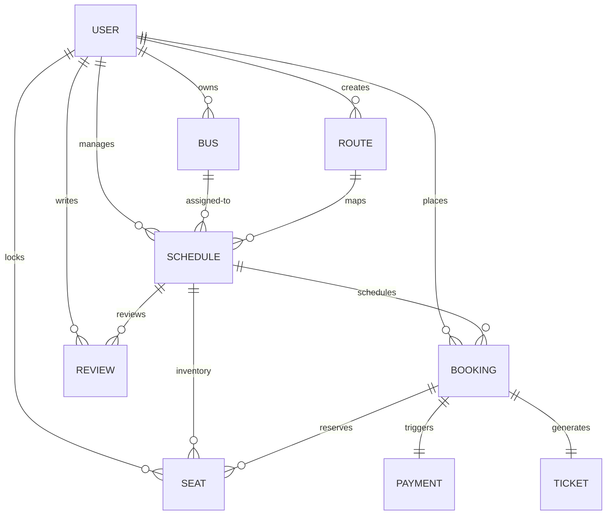
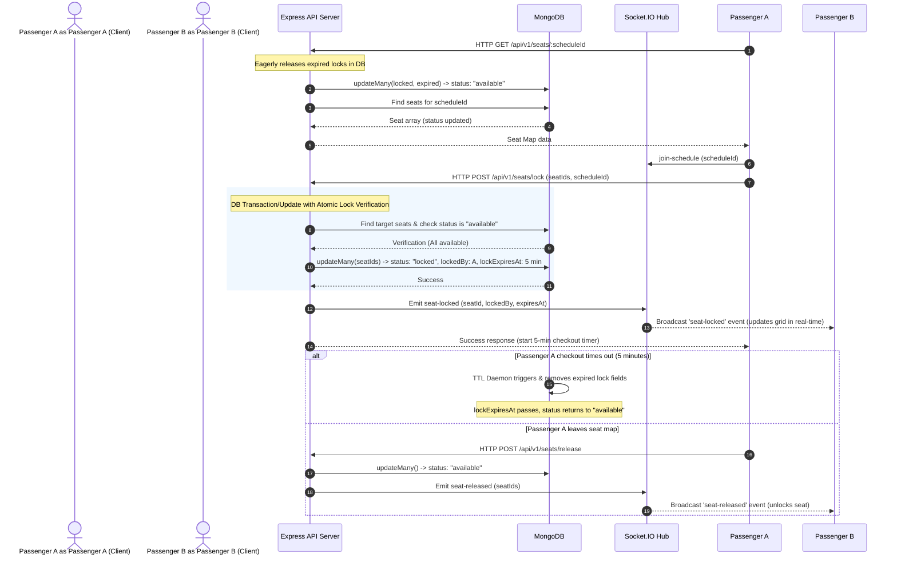
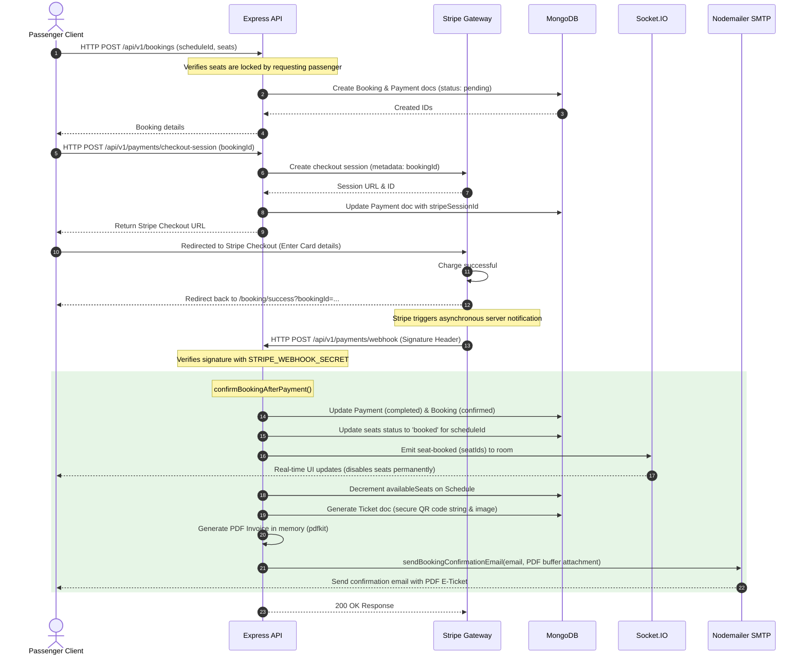
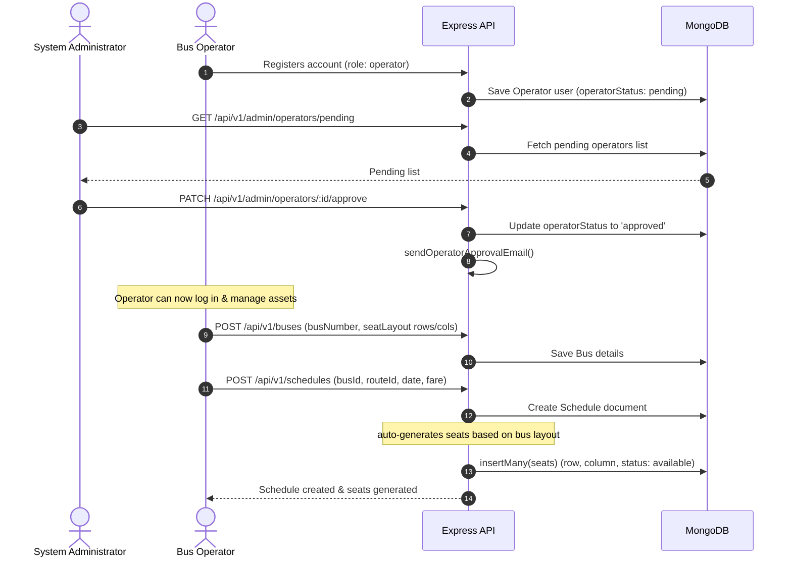

# BusGo - Bus Ticket Reservation System
## Architecture & Technical Reference Manual

Welcome to the technical reference manual for **BusGo**. This document is designed to provide developers, architects, and stakeholders with a complete, end-to-end understanding of the BusGo platform, its codebase structure, technical stacks, internal systems, database models, and communication flows.

---

## 1. Executive Summary & Core Features

**BusGo** is a modern, full-stack, multi-tenant bus ticket reservation system. It provides a passenger-facing interface for searching, locking, and booking seats; an admin and operator dashboard for managing fleets, routes, schedules, bookings, and generating financial/analytical reports; and a scalable API gateway handling authentication, payment, real-time concurrency, PDF ticket compiling, and email notifications.

### Core Features
- **Real-Time Seat Locking**: When selecting seats, they are instantly locked for 5 minutes via WebSockets ([Socket.io](https://socket.io/)). A MongoDB TTL index handles automated server-side expiration fallback.
- **Role-Based Authentication**: Custom access-control middleware segregating `passengers`, `operators`, and `admins`. Uses JWT access/refresh tokens securely delivered via HTTP-only cookies and Authorization headers.
- **Flexible Fare Scheduling**: Operators set routes with multiple stops, define seat counts, configure seat row-column layouts (window vs. aisle vs. middle), and schedule buses. The server auto-generates seat maps based on the bus layout on scheduling.
- **Stripe Payments with Webhooks**: Fully automated Stripe checkout workflow that handles refunds, transaction completion confirmations asynchronously via Stripe webhooks, and concurrency safety.
- **Automated E-Ticket Compilation**: Generates a PDF receipt containing a high-density, secure QR code using `pdfkit` and `qrcode` libraries, emailed instantly on booking confirmation.
- **Analytical Reporting**: Dashboards displaying key KPIs, passenger manifests, route utilization rates, and overall revenue trends with visual charts.

---

## 2. Technology Stack

The project uses a complete **MERN** (MongoDB, Express, React, Node.js) architecture with specialized libraries:

### Backend
- **Node.js (v18+) & Express**: RESTful API server using ES Modules (`"type": "module"`).
- **Mongoose & MongoDB**: Object Data Modeling (ODM) managing persistent data. Uses compound indexes and TTL indexes for high performance.
- **Socket.IO**: Bi-directional WebSocket communication for real-time seat locks and state updates.
- **Stripe SDK**: Processes payment sessions, handles secure refunds, and verifies webhook signatures.
- **Nodemailer**: Connects to SMTP providers (e.g. Gmail) to deliver welcome, reset, confirmation, and cancellation emails.
- **PDFKit & QRCode**: Renders transactional PDF tickets containing base64 generated QR codes on a server-side canvas.
- **Cloudinary SDK & Multer**: Multipart form-data handling and cloud-based image storage.
- **Security & Compression**: 
  - `helmet`: Enhances HTTP header security.
  - `cors`: Handles Cross-Origin Resource Sharing.
  - `compression`: Compresses response bodies (gzip) to speed up transfers.
  - `express-rate-limit`: Protects against brute-force/DDoS attacks.
  - `bcryptjs`: Secure password hashing using salt rounds (12).
  - `express-validator`: Payload parsing and input sanitation.

### Frontends (Passenger Client & Admin Dashboard)
- **React (v18)**: Component-based UI rendering.
- **Vite**: Ultra-fast build tool and local development server.
- **Redux Toolkit & RTK Query**: 
  - *Slices*: Manages global client state (session status, search fields, active seat choices).
  - *RTK Query*: Declarative, caching API client that automatically handles async requests, loading/error states, and invalidation tags.
- **Tailwind CSS**: Utility-first CSS styling framework.
- **Framer Motion**: Smooth micro-animations and page transitions.
- **Lucide React**: Clean vector icons.
- **Recharts**: Responsive charts showing revenue and bookings.
- **React Hook Form & Zod**: Form validation with Schema-based runtime type verification.
- **React Hot Toast**: Real-time pop-up feedback notifications.

---

## 3. Directory and File Structure

The workspace is organized as a multi-workspace structure containing three sub-projects:

```
Bus-Ticket-System/
├── package.json         # Root scripts (starts concurrently backend, client, and admin)
├── client/              # Passenger-facing React client
├── admin/               # Administrator/Operator management React client
└── server/              # Node.js + Express API Server
```

---

### 3.1 Backend Layout (`server/`)

Inside the [server](file:///d:/Bus-Ticket-System/server) directory, the backend follows a clean MVC/Service architectural pattern:

```
server/
├── index.js             # Express API & Socket.io server configuration
├── package.json         # Node.js dependencies and script mappings
├── .env.example         # Template environment configuration
└── src/
    ├── seed.js          # Database populator script for development
    ├── config/          # Global services & database connections setup
    ├── controllers/     # Route logic handlers (interacts with models & services)
    ├── middleware/      # Authentication, role verification, and error handlers
    ├── models/          # Mongoose collection schemas
    ├── routes/          # REST API endpoints mapping
    ├── services/        # Third-party wrappers (Emails, PDF compilation, Sockets, QR)
    └── utils/           # Shared helper functions (JWT, responses, error wrappers)
```

#### Key Files Description (Backend)

- **Entry Point**: [server/index.js](file:///d:/Bus-Ticket-System/server/index.js) initializes the Express app, attaches the HTTP Server instance to Socket.IO, connects to MongoDB, mounts top-level security middleware, registers the Stripe webhook body parser (which requires a raw buffer), maps routing modules, and starts listening on ports.
- **Configurations ([server/src/config/](file:///d:/Bus-Ticket-System/server/src/config))**:
  - [db.js](file:///d:/Bus-Ticket-System/server/src/config/db.js): MongoDB connection handler using Mongoose.
  - [env.js](file:///d:/Bus-Ticket-System/server/src/config/env.js): Directs dotenv to load system environment variables.
  - [stripe.js](file:///d:/Bus-Ticket-System/server/src/config/stripe.js): Configures and returns the Singleton Stripe instance.
  - [cloudinary.js](file:///d:/Bus-Ticket-System/server/src/config/cloudinary.js): Configures Cloudinary details for media upload.
- **Mongoose Schemas ([server/src/models/](file:///d:/Bus-Ticket-System/server/src/models))**:
  - [User.js](file:///d:/Bus-Ticket-System/server/src/models/User.js): Configures credentials, hashing, verification states, refresh tokens, roles (`passenger`, `operator`, `admin`), and operator status.
  - [Bus.js](file:///d:/Bus-Ticket-System/server/src/models/Bus.js): Tracks bus metadata and row/column seat layout geometry mapping.
  - [Route.js](file:///d:/Bus-Ticket-System/server/src/models/Route.js): Defines starting point, destination, stop-overs, distance, and duration.
  - [Schedule.js](file:///d:/Bus-Ticket-System/server/src/models/Schedule.js): Joins a Bus, Route, and Operator at a specified date and time.
  - [Seat.js](file:///d:/Bus-Ticket-System/server/src/models/Seat.js): Stores coordinates and statuses (`available`, `locked`, `booked`) for seats linked to a schedule. Features a compound index for fast searches and a TTL expiration index on `lockExpiresAt`.
  - [Booking.js](file:///d:/Bus-Ticket-System/server/src/models/Booking.js): Records booking attempts, passengers, selected seats, total prices, and refund values.
  - [Payment.js](file:///d:/Bus-Ticket-System/server/src/models/Payment.js): Houses Stripe payment identifiers (checkout session and payment intent IDs) and statuses.
  - [Ticket.js](file:///d:/Bus-Ticket-System/server/src/models/Ticket.js): Holds QR data, base64 images, and scanned status.
  - [Review.js](file:///d:/Bus-Ticket-System/server/src/models/Review.js): Allows rating and text comments per bus.
- **Controllers ([server/src/controllers/](file:///d:/Bus-Ticket-System/server/src/controllers))**:
  - [auth.controller.js](file:///d:/Bus-Ticket-System/server/src/controllers/auth.controller.js): Handles registration, email verification, passwords, and JWT issue/refresh logic.
  - [booking.controller.js](file:///d:/Bus-Ticket-System/server/src/controllers/booking.controller.js): Instantiates pending bookings and executes seat transitions and ticket compilation when payments confirm.
  - [payment.controller.js](file:///d:/Bus-Ticket-System/server/src/controllers/payment.controller.js): Creates Stripe Checkout sessions and listens for Stripe webhook notifications.
  - [seat.controller.js](file:///d:/Bus-Ticket-System/server/src/controllers/seat.controller.js): Exposes handlers to fetch layout states and trigger locked or released states.
  - [admin.controller.js](file:///d:/Bus-Ticket-System/server/src/controllers/admin.controller.js): Aggregates system metrics (revenue, registrations) and handles Operator validation.
- **Middleware ([server/src/middleware/](file:///d:/Bus-Ticket-System/server/src/middleware))**:
  - [auth.middleware.js](file:///d:/Bus-Ticket-System/server/src/middleware/auth.middleware.js): Validates incoming JWT headers/cookies and appends the user context.
  - [role.middleware.js](file:///d:/Bus-Ticket-System/server/src/middleware/role.middleware.js): Inspects role levels (e.g. operators must also be approved).
  - [error.middleware.js](file:///d:/Bus-Ticket-System/server/src/middleware/error.middleware.js): Universal exception catch-all returning JSON error replies.
- **Services ([server/src/services/](file:///d:/Bus-Ticket-System/server/src/services))**:
  - [socket.service.js](file:///d:/Bus-Ticket-System/server/src/services/socket.service.js): Emits real-time state events to room channels. Also contains the helper methods that lock/unlock seats in the database.
  - [pdf.service.js](file:///d:/Bus-Ticket-System/server/src/services/pdf.service.js): Compiles PDF binary buffers dynamically.
  - [qr.service.js](file:///d:/Bus-Ticket-System/server/src/services/qr.service.js): Creates base64 QR data URLs.
  - [email.service.js](file:///d:/Bus-Ticket-System/server/src/services/email.service.js): Dispatches custom HTML template mailers using Nodemailer.

---

### 3.2 Passenger Client Layout (`client/`)

The passenger dashboard uses React and Vite:

```
client/
├── index.html           # Main HTML container
├── package.json         # Front-end dependencies and build configurations
├── tailwind.config.js   # Tailwind style customizations
├── vite.config.js       # Vite build configurations
└── src/
    ├── main.jsx         # App mounting layer (BrowserRouter, Store Provider)
    ├── App.jsx          # Route switcher mapping page files
    ├── index.css        # Custom base styles and Tailwind setup
    ├── hooks/           # Custom React hooks (e.g. useAuth)
    ├── utils/           # Front-end helper libraries
    ├── store/           # Redux Toolkit setup
    │   ├── store.js     # Redux store core configurator
    │   ├── api/         # RTK Query service endpoints (Axios base)
    │   └── slices/      # Front-end local status slices
    ├── components/      # Modular, reusable subcomponents
    └── pages/           # View layouts (routed directly)
```

#### Key Files Description (Client Pages)

- [LandingPage.jsx](file:///d:/Bus-Ticket-System/client/src/pages/LandingPage.jsx): Entry page allowing source/destination selection and date picks.
- [SearchResultsPage.jsx](file:///d:/Bus-Ticket-System/client/src/pages/SearchResultsPage.jsx): Displays available routes, letting users filter by operators, departure hours, fares, and bus styles (AC, Sleeper).
- [SeatSelectionPage.jsx](file:///d:/Bus-Ticket-System/client/src/pages/SeatSelectionPage.jsx): Displays the interactive grid of seats. Uses `socket.io-client` to keep choices updated in real-time. Calls REST API to lock seats temporarily.
- [CheckoutPage.jsx](file:///d:/Bus-Ticket-System/client/src/pages/CheckoutPage.jsx): Confirms seat selections and redirects users to the secure Stripe payment gateway.
- [BookingSuccessPage.jsx](file:///d:/Bus-Ticket-System/client/src/pages/BookingSuccessPage.jsx): Post-checkout view displaying details and option to download the compiled PDF ticket.
- [PassengerDashboard.jsx](file:///d:/Bus-Ticket-System/client/src/pages/PassengerDashboard.jsx) / [BookingHistoryPage.jsx](file:///d:/Bus-Ticket-System/client/src/pages/BookingHistoryPage.jsx): Tracks active/cancelled tickets, letting passengers request cancellation refunds directly.
- [ProfilePage.jsx](file:///d:/Bus-Ticket-System/client/src/pages/ProfilePage.jsx): Manages user account configurations and profile images.

---

### 3.3 Admin & Operator Dashboard (`admin/`)

A dedicated dashboard with a layout similar to the client but focused on management:

```
admin/
├── index.html
├── package.json
├── tailwind.config.js
└── src/
    ├── main.jsx         # Sets up Provider, router, and global styles
    ├── App.jsx          # Handles dashboard navigation routes & Role guards
    ├── components/      # Shared layout grids, sidebar navigation, widgets
    ├── store/           # Redux state configuration (same modular layout)
    └── pages/           # Management view pages
```

#### Key Files Description (Admin/Operator Pages)

- [AdminLoginPage.jsx](file:///d:/Bus-Ticket-System/admin/src/pages/AdminLoginPage.jsx): Multi-role login screen.
- [DashboardPage.jsx](file:///d:/Bus-Ticket-System/admin/src/pages/DashboardPage.jsx): Inspects the user's role and routes them to either the `AdminDashboard` or `OperatorDashboard`.
- [AdminDashboard.jsx](file:///d:/Bus-Ticket-System/admin/src/pages/AdminDashboard.jsx): High-level admin overview showing active operators, overall bookings, total tickets sold, and revenue charts.
- [OperatorDashboard.jsx](file:///d:/Bus-Ticket-System/admin/src/pages/OperatorDashboard.jsx): Specific view for approved operators showing statistics for their active buses and schedules.
- [UserManagementPage.jsx](file:///d:/Bus-Ticket-System/admin/src/pages/UserManagementPage.jsx): Admin view to view passenger accounts and toggle their active/blocked statuses.
- [OperatorManagementPage.jsx](file:///d:/Bus-Ticket-System/admin/src/pages/OperatorManagementPage.jsx) / [OperatorPendingPage.jsx](file:///d:/Bus-Ticket-System/admin/src/pages/OperatorPendingPage.jsx): Admin panel to review operator registration files and approve or reject their accounts.
- [BusManagementPage.jsx](file:///d:/Bus-Ticket-System/admin/src/pages/BusManagementPage.jsx): Operator-only page to view, add, or update buses in their fleet, including defining seat layouts (rows, columns, configuration).
- [RouteManagementPage.jsx](file:///d:/Bus-Ticket-System/admin/src/pages/RouteManagementPage.jsx): Lets operators and admins construct route nodes, distance parameters, and stopovers.
- [ScheduleManagementPage.jsx](file:///d:/Bus-Ticket-System/admin/src/pages/ScheduleManagementPage.jsx): Operator page to assign a bus to a route at a specific date/time. Triggers automated seat generation.
- [BookingsPage.jsx](file:///d:/Bus-Ticket-System/admin/src/pages/BookingsPage.jsx): Tracks booking statuses, showing passenger details, payment statuses, and processing cancellations.
- [ReportsPage.jsx](file:///d:/Bus-Ticket-System/admin/src/pages/ReportsPage.jsx): Compiles revenue streams and reservation trends into interactive visual charts using Recharts.

---

## 4. Database Schema Relationships

The database utilizes Mongoose (MongoDB) to enforce structural schemas and relationships:



### Schema Details and Field Mappings

1. **User Schema**: Includes basic user information (`name`, `email`, `password`, `phone`, `profilePicture`), status states (`isVerified`, `isActive`), and credentials for reset/refresh tokens. Field `role` restricts access levels. Operators have an `operatorStatus` (`pending`, `approved`, `rejected`) which is managed by admins.
2. **Bus Schema**: Tracks fleet metadata (`name`, `busNumber`, `type`, `totalSeats`, `amenities`, `photos`, ratings/reviews aggregates) and has a `seatLayout` subdocument:
   - `rows`: Number of seat rows.
   - `columns`: Number of seat columns.
   - `config`: Array of customized seat styles at specific row/column index coordinates.
3. **Route Schema**: Details route info (`source`, `destination`, `distanceKm`, `estimatedDuration`, `isActive`) and a `stops` array mapping waypoints with ordering constraints:
   - `stops: [{ city: String, order: Number }]`
4. **Schedule Schema**: Represents a departure instance mapping a `busId`, `routeId`, and `operatorId` to a specific `date` and times (`departureTime`, `arrivalTime`). It also tracks `fare`, `availableSeats` counts, and trip statuses.
5. **Seat Schema**: Represents inventory instances. Each schedule generation populates a distinct set of seat documents linked to its `scheduleId` with a specific `seatNumber`, coordinates (`row`, `column`), and `type` (window/aisle/middle). 
   - `status`: `available`, `locked`, or `booked`.
   - `lockedBy`: Reference to user holding the lock.
   - `lockExpiresAt`: Timestamp indicating when the lock will automatically release.
   - `bookingId`: Reference to booking once confirmed.
   - **Important MongoDB Index**:
     - `seatSchema.index({ scheduleId: 1, seatNumber: 1 }, { unique: true });` (Avoids double-allocation).
     - `seatSchema.index({ lockExpiresAt: 1 }, { expireAfterSeconds: 0 });` (TTL index to auto-clear locks).
6. **Booking Schema**: Groups selected seats under a passenger identifier for a specific schedule, listing total amounts, refund metrics, cancellation reasons, and payment statuses (`pending`, `confirmed`, `cancelled`, `refunded`).
7. **Payment Schema**: Links a `bookingId` to Stripe parameters (`stripeSessionId`, `stripePaymentIntentId`, `stripeRefundId`) and tracks status.
8. **Ticket Schema**: Details issued tickets, linking `bookingId` and `passengerId` to a unique `qrCodeData` token and a base64 encoded `qrCodeImage` string, tracking whether it has been scanned at boarding.
9. **Review Schema**: Maps ratings (1-5) and comments from passengers to buses. Uses a compound unique constraint:
   - `reviewSchema.index({ busId: 1, passengerId: 1 }, { unique: true });` (Allows only one review per user per bus).

---

## 5. Architectural Communication Flows

The platform coordinates real-time state, payments, and document generations through three main communication flows:

### 5.1 Real-Time Seat Selection & Locking (WebSockets + REST)

To prevent double-booking, the seat selection page uses REST API requests alongside real-time WebSocket events:



---

### 5.2 Stripe Checkout & Webhook Confirmation Flow

The transaction flow operates asynchronously using Stripe Checkout Sessions and server-to-server webhook events:



---

### 5.3 Operator and Admin Flow

Admins and Operators configure and manage system operations:



---

## 6. API Endpoint Inventory

The API endpoints are organized under the base path `/api/v1`:

### 6.1 Authentication (`/auth`)
- `POST /register`: Registers passengers or operators.
- `POST /login`: Log in to get tokens. Sets HTTP-only refresh token cookies and returns the access token.
- `POST /logout`: Invalidates the refresh token.
- `GET /verify/:token`: Verifies user registration email.
- `POST /forgot-password`: Generates reset token and sends link email.
- `POST /reset-password/:token`: Performs password updates.
- `POST /refresh-token`: Rotates access tokens using refresh cookies.
- `GET /me`: Fetches the authenticated user profile.

### 6.2 Passenger Operations
- `GET /buses/search`: Query schedules by source, destination, and date.
- `GET /buses/:id`: Retreives detailed bus parameters and reviews.
- `GET /seats/:scheduleId`: Fetches layout coordinates and seat statuses.
- `POST /seats/lock`: Atomically lock selected seats for 5 minutes.
- `POST /seats/release`: Voluntarily release locked seats.
- `POST /bookings`: Initialise pending bookings.
- `GET /bookings`: Fetch booking history for the logged-in passenger.
- `POST /bookings/:id/cancel`: Cancel booking and triggers Stripe refund.
- `POST /payments/checkout-session`: Generate Stripe checkout URL.
- `POST /payments/webhook`: Listens for Stripe status update notifications.
- `POST /reviews`: Submit a rating and comment on a bus.

### 6.3 Administration and Operator Panels (`/admin` & `/operator`)
- `GET /admin/stats`: General metrics showing revenue, total tickets, and users count.
- `GET /admin/users`: Query user listings.
- `PATCH /admin/users/:id/toggle-status`: Block/unblock passengers.
- `GET /admin/operators/pending`: List operators awaiting registration approvals.
- `PATCH /admin/operators/:id/approve` / `/:id/reject`: Resolve operator status.
- `GET /admin/reports/revenue`: Aggregate financial charts.
- `GET /operator/stats`: Performance parameters for the operator's active fleet.
- `GET /operator/reports/revenue`: Financial streams for the operator.
- `GET /operator/schedules/:id/passengers`: Manifest containing passenger names and seats.
- `POST /buses`, `PUT /buses/:id`, `DELETE /buses/:id`: Operator fleet management.
- `POST /routes`, `PUT /routes/:id`: Route nodes configurations.
- `POST /schedules`, `PUT /schedules/:id`: Schedules configurations.

---

## 7. Security Architecture

BusGo implements modern security practices across all system layers:

1. **Input Validation and Sanitation**: Restricts payloads using `express-validator` schema validators before matching controller routes.
2. **Access Protection (JWT)**: Employs short-lived Access Tokens (e.g. 15 minutes) passed in headers, and long-lived Refresh Tokens stored in secure, `httpOnly`, `sameSite: strict` cookies, preventing XSS-based credential extraction.
3. **Role Enforcement**: Implements route-level role-checking middleware (`isAdmin`, `isOperator`, `isPassenger`). Operators can only access and modify their assigned buses, routes, and schedules.
4. **Stripe Verification**: Inspects signature headers (`stripe-signature`) against raw webhook payloads using Stripe SDK constructor validation to prevent spoofing.
5. **Rate Limiting**: Protects all API pathways with `express-rate-limit` using a window limits (e.g., maximum 200 requests every 15 minutes) to mitigate automated API attacks.
6. **NoSQL Injection Protections**: Mongoose type castings and schema queries protect against NoSQL injections.
7. **Cross-Origin Protections**: Implements `helmet` middleware headers alongside scoped `cors` rules.

---

## 8. Database Seeding & Development Set Up

### 8.1 Environmental Setup
Copy `.env.example` to `.env` inside each project subfolder and set the variables:
- **Server**: Mongo URI, JWT secrets, Stripe secrets, email configurations, and Cloudinary keys.
- **Client & Admin**: Backend API URL and Stripe publishable keys.

### 8.2 Dependency Management
To install packages in the root and all child workspaces, run:
```bash
npm run install:all
```

### 8.3 Seeding the Database
To populate the MongoDB collections with sample routes, buses, users, and schedules, execute:
```bash
npm run seed
```
This inserts:
- **Admin**: `admin@busgo.com` (Password: `Admin@123`)
- **Operator**: `operator1@busgo.com` (Password: `Op@123`)
- **Passenger**: `user1@busgo.com` (Password: `User@123`)

### 8.4 Local Launch
To start the backend server, client, and admin instances concurrently, run:
```bash
npm run dev
```
- API listening on: `http://localhost:5000`
- Passenger Client running on: `http://localhost:5173`
- Admin panel running on: `http://localhost:5174`
